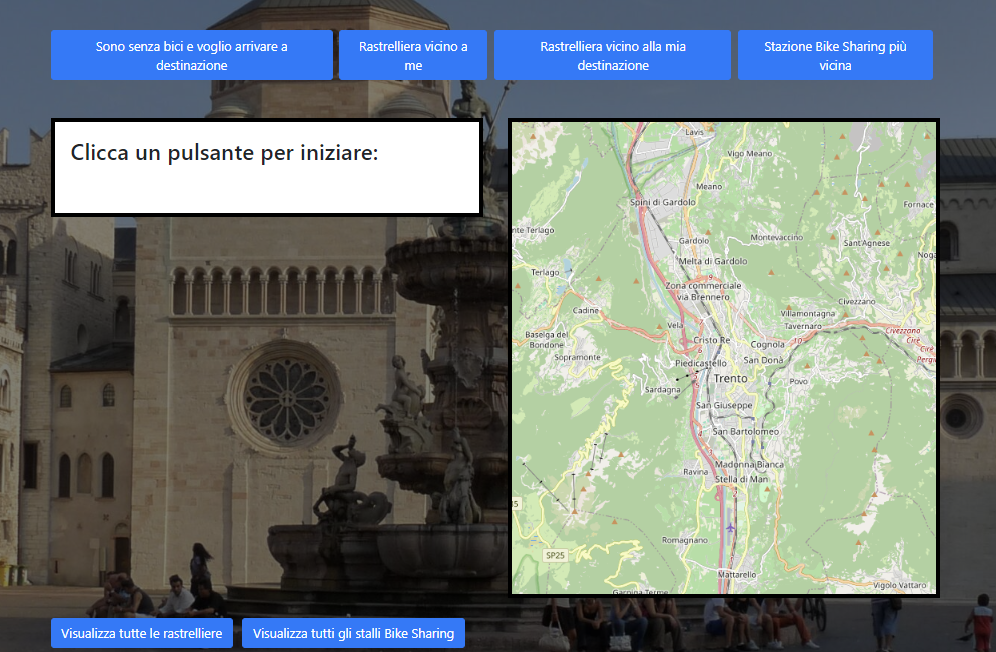

# TrentoInBici
Progetto Ingegneria del Software gruppo 19

Studenti: Luca Claus e [Davide Zanolini](https://github.com/DavideZanolini02)

TrentoInBici è un web service dedicato a chi utilizza la bicicletta per spostarsi nella città di Trento o desidera iniziare a farlo. Progettato specificamente per i ciclisti urbani di Trento, il sito offre strumenti e risorse per rendere gli spostamenti in bici più semplici e sicuri. 

Il sito è accessibile tramite il seguente link: https://trentoinbici.onrender.com/

